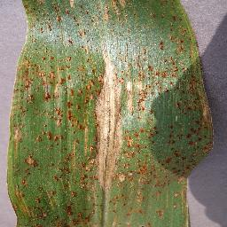
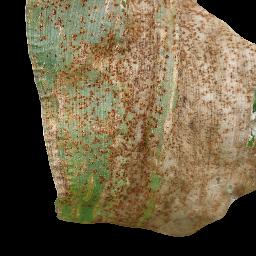
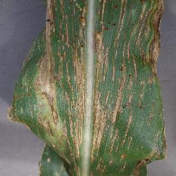
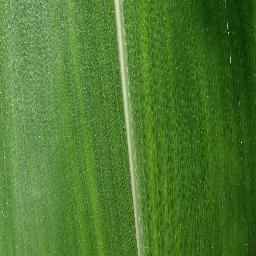
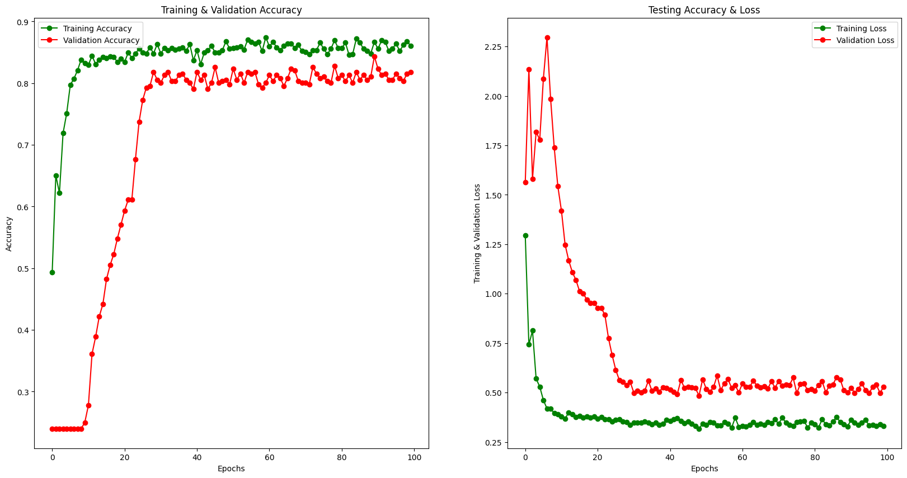
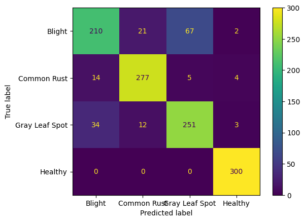

# Corn_Leaf_Disease_Detection

To design, fine-tune, and deploy a robust custom sequential CNN model for multi-class corn leaf disease classification, utilizing processed and augmented data from the Kaggle Corn Leaf Disease Dataset to achieve accurate on-site detection on an NVIDIA AGX Xavier.

## How to Use

This repository contains the following Jupyter Notebooks for corn leaf disease classification:

* `Corn Leaf Detection [Training].ipynb`: This notebook details the training process of the corn leaf disease classification model.
* `Corn Leaf Detection [Testing].ipynb`: This notebook details the evaluation and testing of the trained corn leaf disease classification model.

To explore the project and reproduce the results:

1.  Open and run the Jupyter Notebook `Corn Leaf Detection [Training].ipynb` to understand the model training process.
2.  Subsequently, open and run the Jupyter Notebook `Corn Leaf Detection [Testing].ipynb` to see the evaluation and results of the trained model.

Ensure you have the necessary Python libraries installed (e.g., TensorFlow, OpenCV, scikit-learn, matplotlib) to run the notebooks. You can typically install these using pip:

```bash
pip install tensorflow opencv-python scikit-learn matplotlib jupyter
```

## Dataset

|  |  |  |  |
|--|--|--|--|
| *(Corn Leaf Blight Sample)* | *(Corn Leaf Common Rust Sample)* | *(Corn Leaf Gray Spot Sample)* | *(Corn Leaf Heathly Sample)* |


This project utilized a dataset of 2400 corn leaf images from the Kaggle Corn Leaf Disease Datset (Derived from Plant Docs Dataset), available on Kaggle: .

The dataset is balanced, containing an equal number of all category samples (300 of each). Data augmentation was performed using TensorFlow's `ImageDataGenerator` to enhance the training process and improve the model's generalization.

The dataset was split into the following subsets:

| Set        | Number of Images |
|------------|------------------|
| Training   | 800              |
| Validation | 400              |
| Testing    | 1200             |

## Libraries

NumPy, Pandas, Matplotlib, Seaborn, Tensorflow, Keras, Scikit-Learn, OpenCV-Python


## Training

The custom Convolutional Neural Network (CNN) model was trained using the following parameters:

* **Number of Epochs:** 100
* **Loss Function:** Multi-Categorical Cross-entropy
* **Batch Size:** 32
* **Callbacks:** ReduceLROnPlateau

[If you have an image of the model architecture, you can include it here:]

*(Model Architecture)*

The training and validation performance over the epochs can be visualized in the following curve:


*(Training and Validation Curve)*

This curve illustrates the training and validation accuracy and loss as the training progressed.

## Testing

||precision | recall | f1-score | support |
|--|--|--|--|--|
| Blight | 0.81 | 0.70 | 0.75| 300 |
| CommonRust | 0.89 | 0.92 | 0.91| 300 |
| GrayLeafSpot | 0.78 | 0.84 | 0.81| 300 |
| Healthy | 0.97 | 1.00  | 0.99| 300 |
| accuracy ||| 0.86| 1200 |
| macroavg | 0.86 | 0.86 | 0.86| 1200 |
| weightedavg | 0.86 | 0.86 | 0.86| 1200 |
   
*(Classification Report)*



*(Confusion Matrix (Model Testing))*

## Results

The custom CNN model demonstrated strong performance in detecting corn leaf disease from corn leaf images, achieving 81.8% accuracy. The model showed high precision (0.81 for Blight, 0.89 for CommonRust, 0.78 for GraySpot and 0.97 for Healthy) and recall (0.7 for Blight, 0.92 for CommonRust, 0.84 for GraySpot and 1.0 for Healthy).

## Learning

- **Data Preprocessing and Augmentation**: Gained proficiency in processing and augmenting the Kaggle Corn Leaf Disease Dataset (based on PlantDoc) to enhance model robustness, including techniques like image resizing, normalization, and data augmentation (e.g., rotation, flipping, and scaling) to handle real-world variability in field conditions.

- **CNN Architecture Design**: Developed expertise in designing and implementing a custom sequential Convolutional Neural Network (CNN) for multi-class classification, including selecting appropriate layers (convolutional, pooling, fully connected), activation functions, and hyperparameters to optimize performance for corn leaf disease detection.

- **Model Fine-Tuning**: Learned to fine-tune a CNN model by adjusting learning rates, optimizing loss functions, and applying techniques like dropout and batch normalization to prevent overfitting and improve generalization on the dataset.

- **Edge Deployment**: Acquired skills in deploying a trained CNN model on the NVIDIA AGX Xavier, optimizing it for edge computing constraints, and ensuring efficient real-time inference for on-site disease detection in agricultural environments.

- **Agricultural AI Applications**: Developed a deep understanding of applying AI to real-world agricultural challenges, particularly in enabling rapid, on-site detection of corn leaf diseases to support precision farming and crop health management.

- **End-to-End Project Execution**: Strengthened abilities in managing an end-to-end machine learning pipeline, from data preprocessing and model development to deployment and validation, while addressing domain-specific challenges in agriculture.
